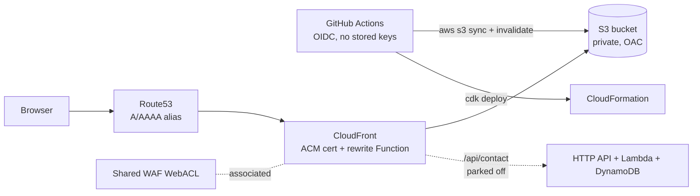

# website

Source for [rickwaterman.com](https://rickwaterman.com) — Rick Waterman's personal site.
A static site (bio, resume, software, fun, links + feeds, 404) built with
[Astro](https://astro.build/) and Tailwind CSS, deployed to S3 + CloudFront with AWS CDK.
It is the hub for the sibling [`blog`](https://github.com/rwaterman/blog) (Hugo) and
[`notes`](https://github.com/rwaterman/notes) (Quartz) sites, which live on subdomains and
share infrastructure owned by this repo.

## Requirements

- Node.js ≥ 22.12 (`engines` in `package.json`)
- Network access at build time: `/software` lists public repos from the GitHub API. Set `GITHUB_TOKEN` (any token; `gh auth token` works) to lift the
  unauthenticated 60 req/hour limit. A failed request fails the build on purpose.
- AWS CLI + CDK bootstrap in `us-west-2` and `us-east-1` for infra work

## Develop

```sh
npm ci
npm run dev        # http://localhost:4321
npm run check      # astro check (types in .astro and .ts)
npm test           # node:test for src/lib
npm run build      # static output in ./dist
npm run preview    # serve ./dist locally
```

`SITE` (e.g. `https://dev.rickwaterman.com`) is read at build time for canonical URLs,
the sitemap, and to point the blog/notes nav links at the matching dev subdomains.
Site identity, nav, external links, and the `/software` pin/hide lists live in
`src/config/site.ts`.

## Content

- **Software** — `software.highlights` in `src/config/site.ts` is the curated list (cards,
  in order, with their own blurbs; a name that is not a public repo fails the build), followed
  by every other public, non-fork, non-archived repo for the owner, most recently pushed
  first. Pin or hide names there too.
- **Fun → GenAI Shaders** — GLSL fragment shaders in `src/shaders/*.frag`, run by
  `src/lib/shader-runtime.ts` (WebGL2, Shadertoy-style `mainImage` + `iResolution` /
  `iTime` / `iMouse`). One shared offscreen GL context renders every visible tile into
  its own 2D canvas, so the page can hold dozens of shaders without hitting the browser's
  context cap; tiles pause offscreen and under `prefers-reduced-motion`. Every tile has a
  Fullscreen button and the section has "Random shader" — both open a fullscreen stage
  (`R` random, `Space` pause, `Esc` close). Register new shaders in `src/config/shaders.ts`.
  Every page also draws one shader as a dimmed full-page backdrop — the `background` prop
  on `Layout` names it per page — on by default (off under `prefers-reduced-motion`),
  toggled by "Shaders: on/off" at the end of the nav, remembered per browser in
  `localStorage`.
- **Fun → Memes / Cat Photos / Playlists** — drop images into `src/assets/memes/` or
  `src/assets/cats/` (alt text comes from the filename); add playlist links to
  `playlists` in `src/config/site.ts`. Empty sections render a placeholder line.
- **Links → Feeds** — `public/feeds.opml` is the single copy: parsed at build time for
  the Feeds section of `/links` and served as-is for download. Replace the file to update
  the list.

## Layout

```
src/
  pages/        index, resume, software, fun, links (+ feeds), legal, 404
  components/   Header, Footer, Section
  layouts/      Layout.astro
  config/       site.ts — name, nav, external links, software, playlists; shaders.ts
  lib/          github.ts, opml.ts, fun.ts, slug.ts, shader-runtime.ts (+ node:test files)
  shaders/      *.frag fragment shader bodies
  assets/       memes/, cats/ (processed by astro:assets)
  styles/       global.css (Tailwind 4 tokens + component classes)
public/         static assets (resume PDF, feeds.opml, og.png, favicon)
infra/          AWS CDK app (TypeScript)
  bin/website.ts
  lib/shared-stack.ts   account-wide singletons (us-west-2)
  lib/edge-stack.ts     shared WAF (us-east-1)
  lib/cert-stack.ts     per-env ACM certificate (us-east-1)
  lib/site-stack.ts     one environment (us-west-2)
  lib/site-config.ts    SITE_ENVS, account/region/zone
.github/workflows/
  deploy.yml    build + publish content
  infra.yml     cdk deploy
```

## Architecture



The home region is `us-west-2`; everything that can live there does (buckets,
distributions, roles, SSM). CloudFront requires its ACM certificate and a
`CLOUDFRONT`-scoped WAF WebACL in `us-east-1`, so those sit in thin edge stacks and are
passed to the home-region stacks with CDK `crossRegionReferences`. DNS is the
`rickwaterman.com` hosted zone.

| Stack | Region | Contents |
| --- | --- | --- |
| `WebsiteEdge` | us-east-1 | Shared CloudFront WebACL |
| `WebsiteCert<Env>` | us-east-1 | That environment's DNS-validated ACM certificate |
| `WebsiteShared` | us-west-2 | OIDC provider, `website-infra-deploy` role, SSM param with the WebACL ARN |
| `WebsiteSite<Env>` | us-west-2 | Bucket, distribution, DNS, content role, SSM params |

### `WebsiteShared` / `WebsiteEdge` — account-wide singletons

Created once and consumed by this repo **and** by `blog` and `notes` (separate CDK apps):

| Resource | Purpose |
| --- | --- |
| GitHub OIDC provider | One per account; all three repos' workflows authenticate through it |
| `website-infra-deploy` role | Assumed by `infra.yml` from `develop`; can only assume the CDK bootstrap roles in both regions |
| Shared CloudFront WebACL (`WebsiteEdge`) | One WAF for the apex and every subdomain distribution. Rules: geo-block OFAC-sanctioned countries + RU/BY, 1000 req / 10 min per-IP rate limit, AWS IP-reputation managed group |
| SSM `/website/shared/cloudfront-webacl-arn` (us-west-2) | How blog/notes discover the WebACL at deploy time |

### `WebsiteSite<Env>` — one static-site environment

| Env | Stack | Domain | Deploys from | Content role |
| --- | --- | --- | --- | --- |
| dev | `WebsiteSiteDev` | `dev.rickwaterman.com` | `develop` | `website-content-dev` |
| prod | `WebsiteSiteProd` | `rickwaterman.com` (+ `www` → apex 301) | `main` | `website-content-prod` |

Each environment stack creates: a private, encrypted S3 bucket (prod: `RETAIN`, dev:
destroy + auto-empty); a CloudFront distribution with Origin Access Control and a
viewer-request CloudFront Function (directory-index rewrite, `www` redirect on prod);
Route53 A/AAAA alias records; a branch-scoped OIDC role
that may only write to that environment's bucket and invalidate its distribution; and
SSM parameters `/website/<env>/bucket-name` and `/website/<env>/distribution-id` that the
deploy workflow resolves at run time, so nothing is hardcoded in CI.

A contact form (HTTP API → Lambda → SES, DynamoDB per-IP rate limit, served through the
same distribution at `/api/contact`) is implemented but parked behind
`enableContactForm: false` in `site-config.ts`. Enabling it needs a verified SES identity
and the SecureString parameter `/website/<env>/contact-recipient`.

## CI/CD

Both workflows use OIDC (`id-token: write`) and the repo secrets `AWS_ACCOUNT_ID` and
`HOSTED_ZONE_ID`; no long-lived AWS keys exist.

- **`deploy.yml`** — on push to `develop` (→ dev) or `main` (→ prod), or
  `workflow_dispatch` with an `env` choice. Runs `astro check` and the unit tests, builds
  with the env's `SITE` (and the workflow's `GITHUB_TOKEN` for the repo list), writes a
  `Disallow: /` `robots.txt` on dev, assumes `website-content-<env>`, syncs `dist/` to S3
  (hashed `_astro/*` assets cached immutable for a year, everything else
  `must-revalidate`), then invalidates `/*`.
- **`infra.yml`** — on push to `develop` touching `infra/**`. Assumes
  `website-infra-deploy` and runs `cdk deploy --all` — every stack, dev **and** prod.
  Infra has no `main` path; only content promotion follows `main`.

Branching follows git flow: feature branches → `develop` (dev), releases → `main` (prod).

### First-time / local infra deploy

`website-infra-deploy` is created by `WebsiteShared`, so the very first deploy runs
locally with admin credentials. Both regions must be CDK-bootstrapped:

```sh
cd infra && npm ci
npx cdk bootstrap aws://<account>/us-west-2 aws://<account>/us-east-1
AWS_ACCOUNT_ID=<account> HOSTED_ZONE_ID=<zoneId> npx cdk deploy --all --require-approval never
```

Deploy `WebsiteShared` before the blog/notes infra — they import its OIDC provider and
WebACL ARN.
