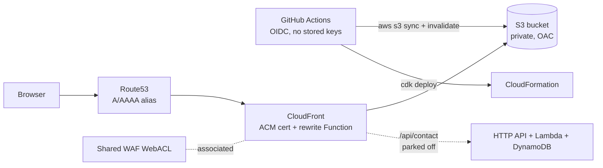

# website

Source for [rickgwaterman.com](https://rickgwaterman.com) — Rick Waterman's personal site.
A small static site (home, links, resume, 404) built with [Astro](https://astro.build/) and
Tailwind CSS, deployed to S3 + CloudFront with AWS CDK. It is the hub for the sibling
[`blog`](https://github.com/rwaterman/blog) (Hugo) and
[`notes`](https://github.com/rwaterman/notes) (Quartz) sites, which live on subdomains and
share infrastructure owned by this repo.

## Requirements

- Node.js ≥ 22.12 (`engines` in `package.json`)
- AWS CLI + CDK bootstrap in `us-east-1` for infra work

## Develop

```sh
npm ci
npm run dev        # http://localhost:4321
npm run build      # static output in ./dist
npm run preview    # serve ./dist locally
```

`SITE` (e.g. `https://dev.rickgwaterman.com`) is read at build time for canonical URLs,
the sitemap, and to point the blog/notes nav links at the matching dev subdomains.
Site identity, nav, and social links live in `src/config/site.ts`.

## Layout

```
src/
  pages/        index, links, resume, 404
  components/   Header, Footer
  layouts/      Layout.astro
  config/       site.ts — name, nav, external links
  styles/       global.css (Tailwind 4)
public/         static assets (resume PDF, favicon)
infra/          AWS CDK app (TypeScript)
  bin/website.ts
  lib/shared-stack.ts   account-wide singletons
  lib/site-stack.ts     one environment
  lib/site-config.ts    SITE_ENVS, account/region/zone
.github/workflows/
  deploy.yml    build + publish content
  infra.yml     cdk deploy
```

## Architecture



Everything runs in `us-east-1` under the `rickgwaterman.com` hosted zone. The CDK app
(`infra/`) synthesizes one shared stack plus one stack per environment.

### `WebsiteShared` — account-wide singletons

Created once and consumed by this repo **and** by `blog` and `notes` (separate CDK apps):

| Resource | Purpose |
| --- | --- |
| GitHub OIDC provider | One per account; all three repos' workflows authenticate through it |
| `website-infra-deploy` role | Assumed by `infra.yml` from `develop`; can only assume the CDK bootstrap roles |
| Shared CloudFront WebACL | One WAF for the apex and every subdomain distribution. Rules: geo-block OFAC-sanctioned countries + RU/BY, 1000 req / 10 min per-IP rate limit, AWS IP-reputation managed group |
| SSM `/website/shared/cloudfront-webacl-arn` | How blog/notes discover the WebACL at deploy time |

### `WebsiteSite<Env>` — one static-site environment

| Env | Stack | Domain | Deploys from | Content role |
| --- | --- | --- | --- | --- |
| dev | `WebsiteSiteDev` | `dev.rickgwaterman.com` | `develop` | `website-content-dev` |
| prod | `WebsiteSiteProd` | `rickgwaterman.com` (+ `www` → apex 301) | `main` | `website-content-prod` |

Each environment stack creates: a private, encrypted S3 bucket (prod: `RETAIN`, dev:
destroy + auto-empty); a CloudFront distribution with Origin Access Control and a
viewer-request CloudFront Function (directory-index rewrite, `www` redirect on prod); a
DNS-validated ACM certificate; Route53 A/AAAA alias records; a branch-scoped OIDC role
that may only write to that environment's bucket and invalidate its distribution; and
SSM parameters `/website/<env>/bucket-name` and `/website/<env>/distribution-id` that the
deploy workflow resolves at run time, so nothing is hardcoded in CI.

A contact form (HTTP API → Lambda → SES, DynamoDB per-IP rate limit, served through the
same distribution at `/api/contact`) is implemented but parked behind
`enableContactForm: false` in `site-config.ts`. Enabling it needs a verified SES identity
and the SecureString parameter `/website/<env>/contact-recipient`.

## CI/CD

Both workflows use OIDC (`id-token: write`) and the repo secrets `AWS_ACCOUNT_ID` and
`HOSTED_ZONE_ID`; no long-lived AWS keys exist.

- **`deploy.yml`** — on push to `develop` (→ dev) or `main` (→ prod), or
  `workflow_dispatch` with an `env` choice. Builds with the env's `SITE`, writes a
  `Disallow: /` `robots.txt` on dev, assumes `website-content-<env>`, syncs `dist/` to S3
  (hashed `_astro/*` assets cached immutable for a year, everything else
  `must-revalidate`), then invalidates `/*`.
- **`infra.yml`** — on push to `develop` touching `infra/**`. Assumes
  `website-infra-deploy` and runs `cdk deploy --all` — every stack, dev **and** prod.
  Infra has no `main` path; only content promotion follows `main`.

Branching follows git flow: feature branches → `develop` (dev), releases → `main` (prod).

### First-time / local infra deploy

`website-infra-deploy` is created by `WebsiteShared`, so the very first deploy runs
locally with admin credentials:

```sh
cd infra && npm ci
AWS_ACCOUNT_ID=<account> HOSTED_ZONE_ID=<zoneId> npx cdk deploy --all --require-approval never
```

Deploy `WebsiteShared` before the blog/notes infra — they import its OIDC provider and
WebACL ARN.
